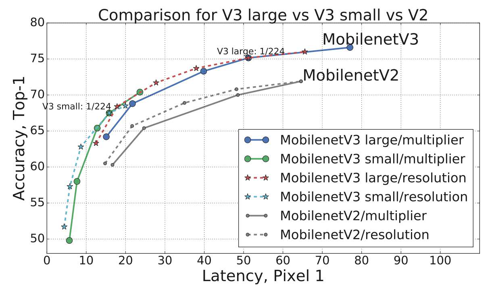
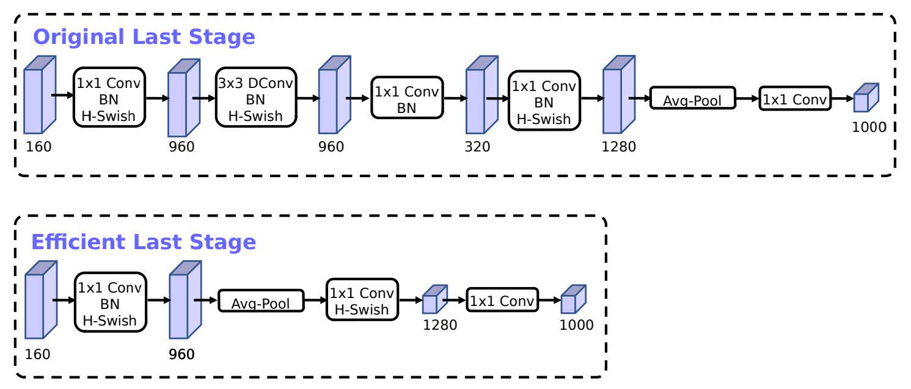
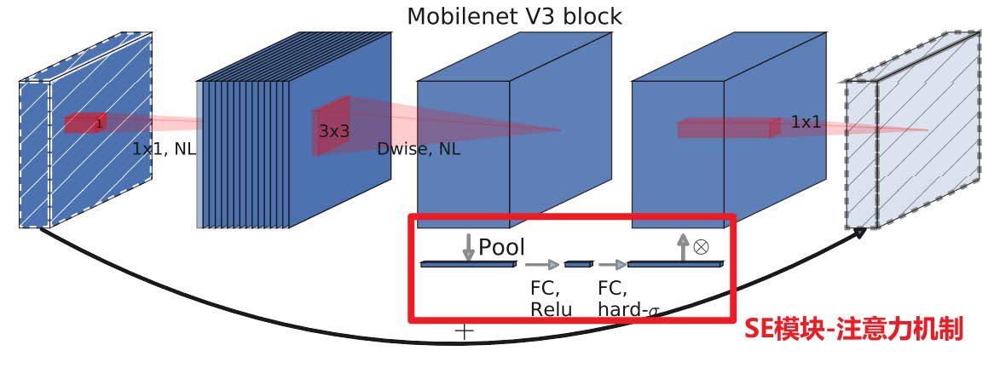
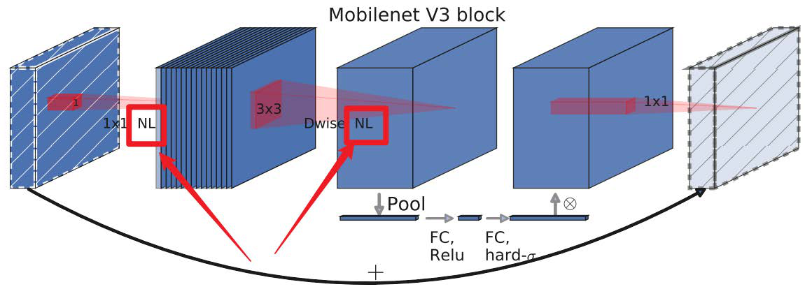
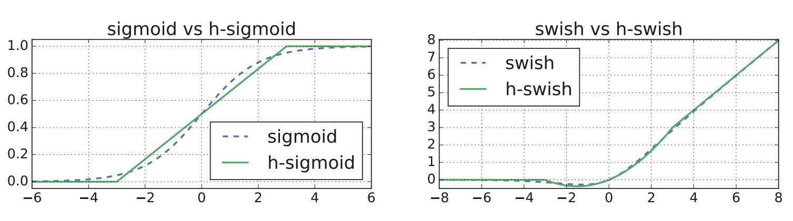

# Saint George Image Classifier (Bifu Test Task)

**中文版本：[README.md](README.md) | Русская версия: [README_RU.md](README_RU.md)**

A reproducible binary image-classification pipeline: deciding **whether an image
contains Saint George** (positive class).
Goal (see `测试描述.txt`): obtain the highest-quality classification model possible
using any legitimate and ethical method.

> **Final result**: E2b MobileNetV3-Large + flip-TTA, one-shot test-set evaluation —
> **Accuracy 0.916 · F1-macro 0.910 · ROC-AUC 0.969**, 44 misclassified out of 525.

- Task definition | Binary classification (semantic level) | "Saint George" is a concept, not a pixel mask
- Main approach | Transfer learning (ImageNet backbone + fine-tuning) | Optimal for 5.4k images under a CPU-only budget
- Leakage prevention | dHash perceptual hashing + grouped splits | Near-duplicates never cross train/val/test
- Class imbalance | Weighted loss (disabled after ablation) | Pos/neg ratio ≈ 0.71:1 (mild)
- Reproducibility | Fixed seeds + config-driven + experiment logs | Anyone can re-run and reproduce

---

## 1. Why E2b MobileNetV3-Large Was Chosen

The choice is not prior preference, but the outcome of **paper evidence + controlled
experiments**.

### 1.1 Paper-level: MobileNetV3's accuracy-efficiency edge

Based on *"Searching for MobileNetV3"* (arXiv:1905.02244) and the accompanying
lecture material. The figures below were extracted from the lecture slides and are
stored in `docs/images/`.

**Figure 1 · Latency-accuracy Pareto comparison (MobileNetV2 vs V3)**



The x-axis is inference latency on a Google Pixel 1; the y-axis is ImageNet Top-1
accuracy. The V3 curve sits above and to the left of V2 — **higher accuracy at the
same latency, lower latency at the same accuracy**. Quantified conclusions from the paper:

- MobileNetV3-**Large** vs V2: Top-1 **+3.2%**, 20% **less** compute time;
- MobileNetV3-**Small** vs V2 at equal latency: **+6.6%** accuracy.

**Figure 2 · Table 1 network-structure table (Large variant)**



Each layer specifies `Input / Operator(bneck×k×k) / exp_size / #out / SE / NL / stride`,
with 224×224×3 input and a backbone of 15 inverted-residual blocks (bneck) plus
head/tail convolutions. Key columns: `SE` = whether the block carries channel
attention; `NL` = activation (HS = h-swish, RE = ReLU); `s` = DW-convolution stride.
This is exactly the architecture fine-tuned in this project.

**Figure 3 · SE module structure**





Each channel passes through global average pooling → FC (reduction to 1/4 channels,
ReLU) → FC (restore channel count, h-sigmoid) → element-wise multiplication with the
original features. In short: **up-weight important channels, down-weight weak ones**.
For a task where "Saint George appears in a local region of the image (paintings /
statues / emblems / stained glass)", channel attention adaptively highlights
discriminative features.

**Figure 4 · h-sigmoid / h-swish activations**



h-sigmoid and h-swish are ReLU6-based hard approximations of sigmoid / swish: similar
curve shapes but far simpler formulas — faster to compute and differentiate, and
quantization-friendly.

**Figure 5 · Expensive-layer redesign (Original vs Efficient Last Stage)**

The first convolution kernel is reduced 32→16 (no accuracy loss, saves 2ms); the four
tail convolutions are streamlined into "conv → pool → two convs" (saves 7ms, roughly
11% of total inference time). [Data quoted from paper §5; no matching slide in the
lecture material.]

Summary of the three innovations (matching Figures 1–4 above): **① SE channel
attention embedded in the bneck**; **② h-swish/h-sigmoid hard-saturating
activations** (swish-level accuracy without exponentiation, quantization-friendly);
**③ NAS (MnasNet RL multi-objective search over accuracy+latency) + NetAdapt
per-layer refinement**. The DW-conv + SE combination makes V3-Large far cheaper on
CPU than same-accuracy convolutional networks — the decisive advantage under this
project's CPU-only budget.

> Known limitation (lecture material, §3): V3 was tuned for Pixel hardware and may
> not be cost-optimal on other devices. In our own measurements (Intel CPU + PyTorch),
> V3-Large remained the best accuracy-speed trade-off, so this did not apply.

### 1.2 Project experiments: 5 controlled comparisons, E2b wins twice

Uniform protocol (same split / training loop / tuning rules; only one variable at a
time), **validation F1-macro** as the sole model-selection criterion; the test set
was evaluated exactly once at the end:

| Exp | Variable | Backbone | val F1-macro | val Acc | val AUC | Train time |
|-----|----------|----------|--------------|---------|---------|------------|
| E0 | Baseline | ResNet18 | 0.9169 | 0.9221 | 0.9589 | 66 min |
| E1 | Weighted loss | ResNet18 | 0.8839 ↓ | 0.8897 | 0.9455 | 61 min |
| E2a | Backbone | EfficientNet-B0 | 0.9041 | 0.9087 | 0.9604 | 69 min |
| **E2b** | **Backbone** | **MobileNetV3-L** | **0.9183 ↑** | **0.9240** | — | **~36 min** |
| E3 | Strong augment (RandAug+CutMix) | ResNet18 | 0.8957 ↓ | 0.9011 | 0.9622 | 100 min |

**Conclusion**: E2b has the best accuracy **and** the fastest training (about half of
the other runs). Key parameters: `batch_size 16` (7.8GB RAM constraint), `8 epochs`
(early-stopping patience 4, best checkpoint at ep6), `lr 3e-4` + AdamW + cosine,
ImageNet-pretrained fine-tuning. Final test (+flip-TTA): acc 0.916 / F1-macro 0.910 /
AUC 0.969 (confusion matrix TN=309 FP=8 FN=36 TP=172).

A further implicit argument: **capacity matched to data scale** — with 5,406 images,
heavier backbones (EfficientNet-B0 etc.) brought no gains; MobileNetV3-Large sits at
the accuracy-capacity sweet spot.

---

## 2. Environment Setup

```bash
# 1. (Recommended) create and activate a virtual environment
python -m venv .venv && source .venv/bin/activate      # Windows: .venv\Scripts\activate

# 2. CPU PyTorch (TUNA mirror recommended; the official source has unstable SSL in CN)
pip install torch torchvision --index-url https://mirrors.tuna.tsinghua.edu.cn/pytorch/wheel/cpu/

# 3. Remaining dependencies
pip install -r requirements.txt -i https://pypi.tuna.tsinghua.edu.cn/simple
```

Conda (`environment.yml`) and Docker (`Dockerfile`, CPU image, one-shot
prepare→train→evaluate) are also provided.

## 3. Running on CPU

Training artifacts (checkpoints, splits) are already produced; **if you only want
inference you can skip steps 1–2**.

```bash
# Stage 1 — data preparation: unzip, validate, dHash dedup clustering, split, EDA
python scripts/prepare_data.py            # or --pos-zip/--neg-zip for archive paths

# Stage 2 — training (about 0.5–1.7 h per experiment on CPU)
python scripts/train.py --experiment mobilenet_v3

# Stage 3 — evaluate the BEST checkpoint on the test set (once only)
python scripts/evaluate.py --experiment mobilenet_v3 --split test --tta

# Stage 4 — inference on new images / directories
python scripts/predict.py --experiment mobilenet_v3 --input image.jpg --tta
python scripts/predict.py --experiment mobilenet_v3 --input some_dir/ --tta
```

Available experiment names: `baseline_resnet18` (E0), `e1_resnet18_full` (E1),
`efficientnet_b0` (E2a), `mobilenet_v3` (**E2b, best**), `e3_augment` (E3).

**CPU notes**:
- Keep `batch_size` ≤ 16 (7.8GB RAM cap; batch 64 will OOM);
- CPU throughput optimizations are built in: JPEG draft decoding,
  `torch.set_num_threads`, persistent DataLoader — measured 4.3 → 10.7 img/s;
- If ImageNet weights are not pre-downloaded, the first run fetches them online
  (offline: place them under `~/.cache/torch/hub/checkpoints/`).

## 4. Running on GPU

**Not a single line of code changes.** Device selection is centralized in
`src/common.py`:

```python
return torch.device("cuda" if torch.cuda.is_available() else "cpu")
```

The device for training/evaluation/inference is decided automatically by this one
function; tensors all go through `.to(device)` and checkpoints load with
`map_location` — the code is device-agnostic. Just swap the environment:

```bash
# 1. Uninstall the CPU build, install a CUDA build (pick cu121/cu124 per driver)
pip uninstall torch torchvision
pip install torch torchvision --index-url https://download.pytorch.org/whl/cu121

# 2. Verify the GPU is visible
python -c "import torch; print(torch.cuda.is_available(), torch.cuda.get_device_name(0))"

# 3. Run as usual — GPU is used automatically
python scripts/train.py --experiment mobilenet_v3
```

**Two recommended config changes after moving to GPU** (optional; they lift the
CPU-era limits):

| Location | Old | Suggested | Reason |
|----------|-----|-----------|--------|
| `configs/experiments/mobilenet_v3.yaml` → `data.batch_size` | 16 | 64–128 | 16 was a RAM-forced cap; VRAM handles more, throughput rises sharply |
| `configs/base.yaml` → `data.num_workers` | 4 | 8 | GPU consumes data faster; more loader processes keep it fed |

Expected gain: a ~36-minute CPU run takes roughly **2–4 minutes** on a mainstream
single GPU, freeing budget for options CPU could not afford (higher resolution,
larger backbones, longer schedules).

## 5. Customization Guide

**First priority: change configs, not code** (re-run train to take effect):

| What to tune | Where |
|--------------|-------|
| LR / epochs / early stopping | `configs/base.yaml` → `training:` |
| Input resolution | `configs/base.yaml` → `data.image_size` |
| Batch size | each experiment yaml → `data.batch_size` |
| Augmentation | `configs/base.yaml` → `augment:` (RandAug / CutMix switches) |
| New experiment | copy a `configs/experiments/*.yaml`, rename → `--experiment new_name` |

**Second priority: change code** (entry points in the file-responsibility table below):

- Add a backbone → `BACKBONES` registry in `src/models/builder.py` (must expose a
  replaceable classification head);
- Training loop / early stopping → `src/training/trainer.py`;
- Loss functions → `src/training/losses.py`;
- Transforms / augmentation → `src/data/dataset.py`;
- Metrics → `src/eval/evaluate.py`;
- Prediction output format → `src/inference/predict.py`.

**Committing changes** (local `main` tracks the remote; proxy and credentials are
configured):

```bash
git add -A && git commit -m "feat: description of change" && git push
```

**Methodological note**: if a change affects the split or training, tune only on the
**validation set**; keep the test set for a single final evaluation to avoid
contaminating the estimate (the experiment report follows this principle).

## 6. Directory Layout & File Responsibilities

```
saint_george_classifier/
├── README.md                    # This project's main (Chinese) document
├── README_EN.md                 # English README (mirrors the Chinese version)
├── README_RU.md                 # Russian README (mirrors the Chinese version)
├── docs/
│   └── images/                  # Figures for the selection rationale (extracted
│       │                        #   from the MobileNetV3 lecture slides)
│       ├── fig1_pareto_v3_vs_v2.png   # Latency-accuracy Pareto comparison
│       ├── fig2_table1_structure.png  # Table 1: V3-Large network structure
│       ├── fig3a_v3_bneck_se.png      # V3 inverted-residual block (with SE)
│       ├── fig3b_se_module.png        # SE module working principle
│       └── fig4_activations.png       # h-sigmoid / h-swish activation curves
├── requirements.txt             # pip dependencies (pinned)
├── environment.yml              # conda environment
├── Dockerfile                   # one-shot CPU reproduction image
├── PUSH_GUIDE.md                # GitHub push guide & troubleshooting
├── configs/
│   ├── base.yaml                # all default parameters (train/data/aug/eval)
│   └── experiments/             # 5 experiment configs, each overriding a subset
├── src/                         # core library
│   ├── common.py                # paths, seeds, device selection, config deep-merge
│   ├── data/
│   │   ├── prepare.py           # unzip, corruption check, dHash cluster dedup, export
│   │   ├── split.py             # grouped leakage-proof split (80/10/10)
│   │   └── dataset.py           # Dataset definition & train/eval transforms
│   ├── models/builder.py        # backbone factory (BACKBONES registry, swapped head)
│   ├── training/
│   │   ├── losses.py            # class weights, label smoothing, CutMix/MixUp
│   │   └── trainer.py           # training loop, early stopping, checkpoints, logs
│   ├── eval/evaluate.py         # metrics, confusion matrix, error export, flip-TTA
│   └── inference/predict.py     # single/multi image/directory prediction with TTA
├── scripts/                     # CLI entry points (one command per stage)
│   ├── prepare_data.py          # Stage 1: data preparation
│   ├── train.py                 # Stage 2: training
│   ├── evaluate.py              # Stage 3: test-set evaluation
│   └── predict.py               # Stage 4: inference
├── data/                        # raw (originals, not in git) / splits (CSV)
├── experiments/                 # logs / checkpoints / metrics / misclassified
└── reports/                     # EDA.md, EXPERIMENTS.md, REPORT.md
```

## 7. Network Architecture & Training Pipeline

```
Image ─▶ transforms (resize / RandomResizedCrop / flip / jitter / normalize)
      └▶ Backbone (ImageNet weights) ─▶ 2-class head
                                        └▶ CrossEntropyLoss (+class weights / label smoothing)
                                            └▶ AdamW + CosineAnnealing / EarlyStopping
```

The deliberately tight `RandomResizedCrop` scale range in training augmentation is a
considered choice: Saint George appears across a huge scale range (paintings,
statues, emblems, stained glass), and tight-crop augmentation improves scale
robustness.

## 8. Leakage-Prevention Strategy

1. **Perceptual hash** (dHash, 64-bit) computed for every image;
2. **Union-find clustering** of near-duplicates (Hamming distance ≤ threshold);
3. **Cross-class clusters removed outright** — the same visual content under two
   labels is treated as contamination;
4. **Grouped split**: an entire cluster enters exactly one split
   (train/val/test = 80/10/10, stratified by class).

The original 5,700 images become 5,406 after this pipeline (294 cross-class
near-duplicates removed), keeping the generalization estimate honest.

## 9. Reproducibility & FAQ

- **Determinism**: every script calls `set_seed(cfg.seed)` before any work;
- **Config-driven**: edit `configs/*.yaml` rather than code;
- **Full re-run**: `prepare_data.py` → `train.py` → `evaluate.py`;
- *"Why is training slow?"* — the reference machine has no GPU. Move to a GPU host
  or reduce `data.image_size` / `training.epochs`;
- *"Can I add a backbone?"* — register it in `src/models/builder.py`'s `BACKBONES`
  (it must expose a replaceable classification head);
- *Where are checkpoints / raw data?* — large files are not in git: `data/raw/`
  (550MB originals) and `experiments/checkpoints/*.pth` (147MB weights) are excluded
  by .gitignore; regenerate them via the README pipeline.

## 10. Deliverables Checklist

- [x] Python code (prepare / train / inference / evaluate)
- [x] READMEs (rationale / install / CPU·GPU guides / architecture / file roles)
- [x] Results / logs / checkpoints (`experiments/`)
- [x] Experiment report (`reports/EXPERIMENTS.md`: hypothesis→variable→result→conclusion)
- [x] Methodology notes (comments inside each experiment config)
- [x] Final report (`reports/REPORT.md`: metrics, confusion matrix, error analysis, next steps)
- [x] Environment files (`requirements.txt`, `environment.yml`, `Dockerfile`)

---

Thank you for the opportunity
